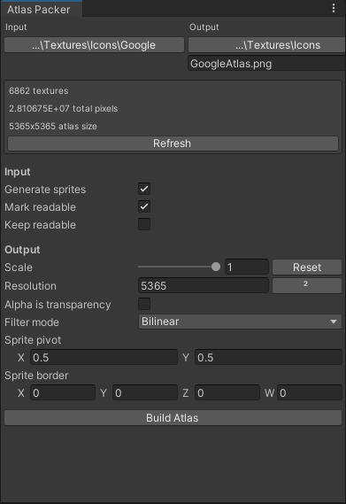

# AtlasPacker

This Unity `EditorWindow` allows you to select a folder that contains multiple textures and convert them into a singular sprite sheet. It packs the textures together and uses the original texture name when slicing the new sprite sheet.

## Preview

